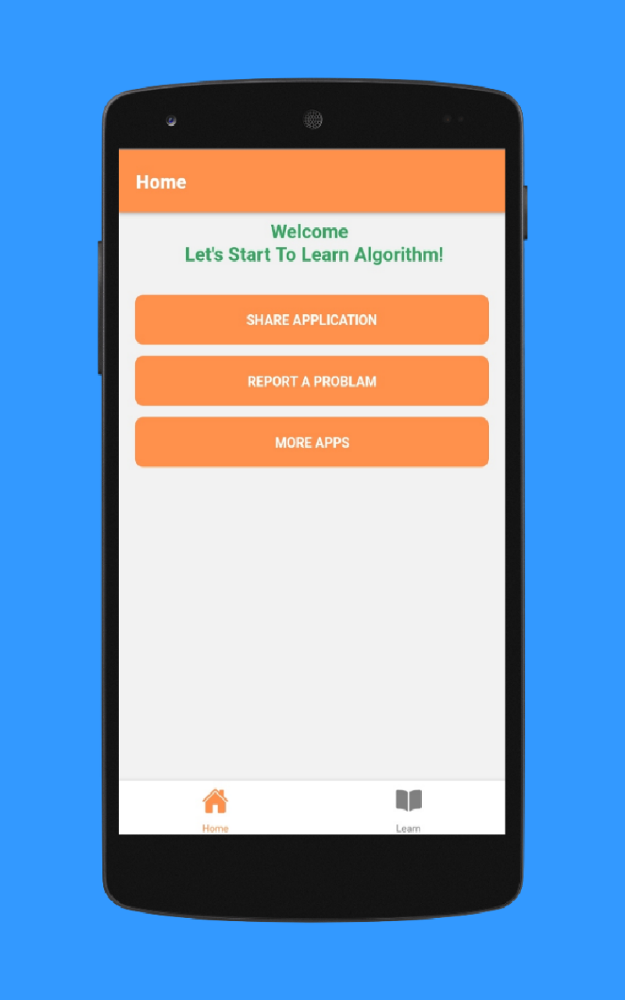
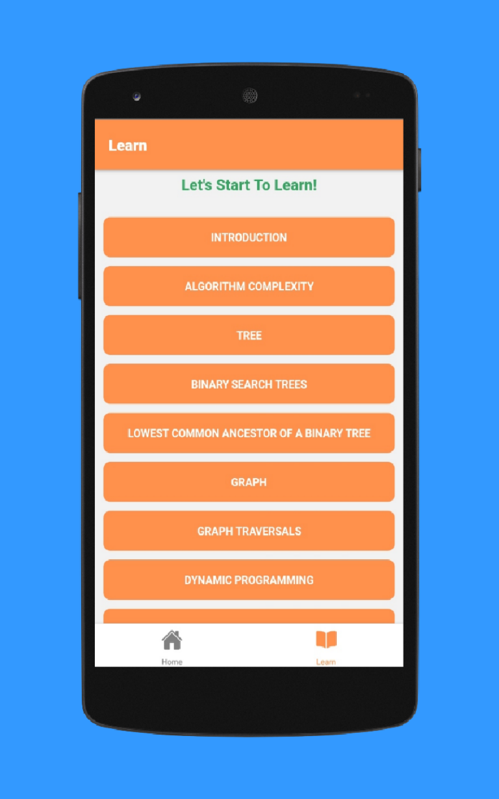
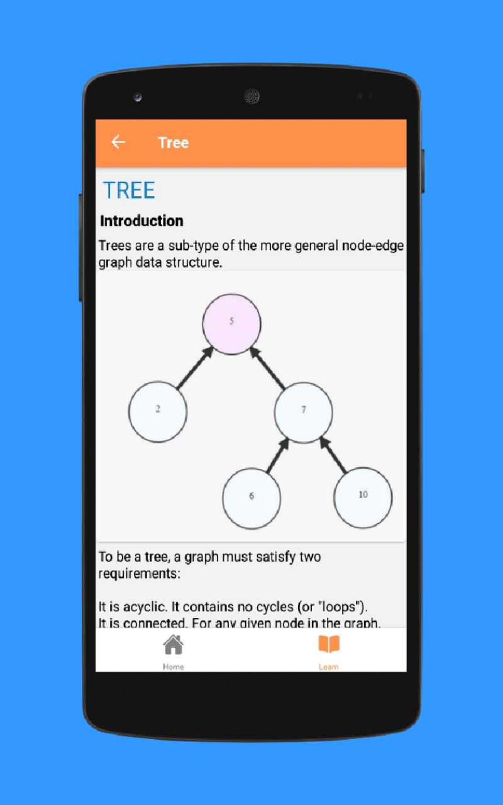
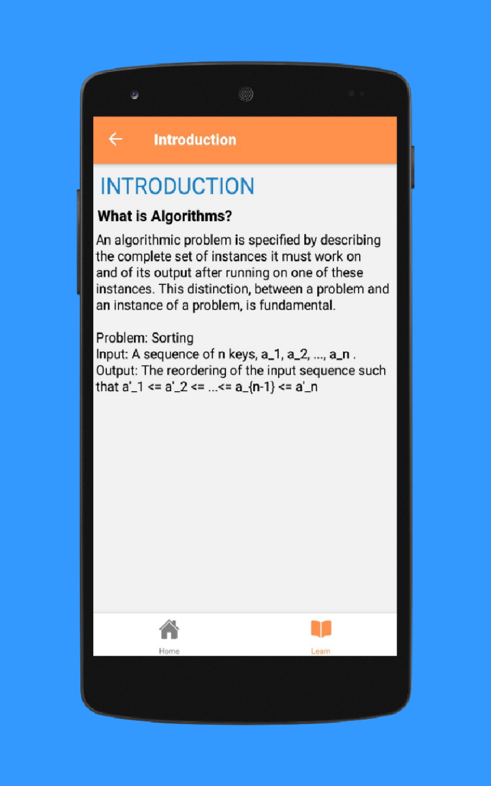

# Algorithms-App

	<h2>This application create for learn about basic of algorithm and algorithm structure. please Download and learn Today.</h2>

<h3>Description:</h3>
	

		Welcome To Algorithm Application.
This app will be describe all about Algorithm like features, What is Algorithm, and how to use them, how to implement.
This app many practical algorithm are available.

Are You Computer engineering / Computer Science Student That is Helpful Application to Learn Algorithm for Job Interview.

See How the following Algorithms are available:
 
 1.Trees 
2.Graph 
3.Graph Traversals 
4.Prim's Algorithm 
5.Line Algorithm 
6.Sorting 
7.Bubble Sort 
8.Merge Sort 
9.Insertion Sort 
10.Quick sort 
11.Selection Sort 
	

	

<h2><a href="https://www.amazon.com/programmers0_0-Algorithms/dp/B08P8RLMDB/ref=sr_1_3?dchild=1&keywords=programmers0_0&qid=1619326192&sr=8-3">GET THIS APP</a></h2>

NOTE: This application are available  only Amazon App store.
	

<h3>Features:</h3>
	<li>App is easy to Navigate for everybody.</li>
	<li>Pocket size</li>
	<li>App is of tiny size and doesn't take much storage space even in low-end devices.</li>
	<li>Trees Algorithm</li>
	<li>Graph Algorithm</li>
	<li>other's Algorithm</li>

<h3>App ScreenShort::</h3>

   
